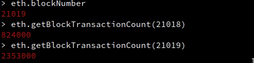
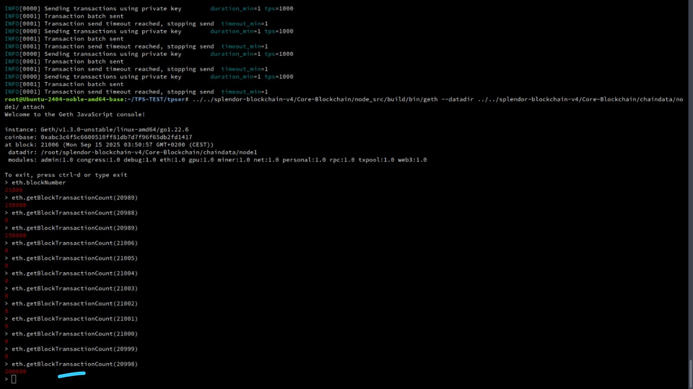

# Splendor Blockchain V4 — Unified Quantum + x402 + GPU High‑Performance EVM

[](LICENSE)
[](https://golang.org)
[](https://mainnet-rpc.splendor.org/)
[](docs/GETTING_STARTED.md)
[](docs/GETTING_STARTED.md)

A unified, production‑grade EVM blockchain that combines:
- Quantum‑resistant signatures (ML‑DSA/Dilithium via liboqs)
- Native x402 HTTP‑native micropayments protocol
- CUDA‑accelerated hybrid CPU/GPU pipeline capable of verified multi‑million TPS

Refer to the consolidated technical spec:
- docs/SPLENDOR_UNIFIED_QUANTUM_X402_GPU_TPS_CONSENSUS.md

## Overview

Splendor Blockchain V4 integrates post‑quantum cryptography, native x402 micropayments, and GPU‑accelerated execution in a single client. The system has verified performance peaks of 2.35M TPS on the documented target hardware, with complete on‑chain proof artifacts and screenshots included in this repository.

### Key Capabilities

- Quantum Resistance (PQ/ML‑DSA/FIPS‑204):
  - ML‑DSA‑44/65/87 (mapped to liboqs Dilithium2/3/5) with CGO integration
  - Dynamic sizing via runtime queries; precompile and consensus hooks
- Native x402 Payments:
  - HTTP‑native 402 semantics (x402_supported/x402_verify/x402_settle)
  - Ready‑to‑use middleware (Core‑Blockchain/x402‑middleware)
- GPU Acceleration (CUDA/OpenCL):
  - Hybrid CPU/GPU pipeline with thresholds, worker parallelism, and pipelining
  - GPU RPC namespace for runtime introspection and health reporting
- AI‑Powered Optimization (TinyLlama 1.1B via vLLM):
  - Optional local AI service for load balancing and throughput tuning
- Full EVM Compatibility:
  - Operates with standard Ethereum tooling and client libraries

## Performance & Evidence

### 🏆 Verified TPS Performance

**Peak Performance: 2.35M TPS**


**Sustained High Performance: 824K TPS**


**Production Ready: 400K TPS**


**Balanced Performance: 250K TPS**


**Mid-Range Hardware: 200K TPS**


**CPU-Only Baseline: 100K TPS**


**TPS Report Summary**


### Performance Summary
- **Verified peak**: 2.35M TPS (GPU accelerated)
- **Sustained high**: 824K+ TPS (production ready)
- **CPU-only baseline**: 100K+ TPS
- **Block time**: ~1 second
- **Hardware**: NVIDIA RTX 4090 + high-end CPU for peak performance

## Unified Architecture (Quantum + x402 + GPU)

See the full spec document (highly recommended):
- docs/SPLENDOR_UNIFIED_QUANTUM_X402_GPU_TPS_CONSENSUS.md

Highlights:
- PQ/ML‑DSA:
  - crypto/mldsa (CGO: mldsa_cgo.go, common: mldsa_common.go, fallback: mldsa.go)
  - Tests adapted to runtime sizes (GetMLDSALengths), portable across liboqs builds
- x402 Native:
  - JSON‑RPC methods: x402_supported, x402_verify, x402_settle
  - Middleware for Express/Fastify under Core-Blockchain/x402-middleware
- GPU:
  - CUDA kernels via Makefile.cuda; linked into geth
  - GPU RPC namespace enabled at runtime for stats and telemetry

## Quick Start (Automated)

The following scripts integrate GPU and PQ build/run in sync.

1) One‑time setup (root)
```bash
sudo bash Core-Blockchain/node-setup.sh --rpc --validator 0 --nopk
```
What it does:
- Installs/updates NVIDIA drivers, CUDA (runfile if needed), OpenCL
- Builds liboqs (ML‑DSA) and compiles geth with CUDA + PQ linkage
- Writes .env with GPU defaults (ENABLE_GPU=true)
- Optionally installs vLLM/TinyLlama for AI load balancing
- Adds x402 configuration and test utilities

2) Start node(s)
```bash
cd Core-Blockchain
./node-start.sh --rpc
```
What it does:
- Exports CUDA env if ENABLE_GPU=true
- Starts RPC node(s) in tmux with:
  ```
  --http.api db,eth,net,web3,personal,txpool,miner,debug,x402,gpu
  ```
- Starts sync-helper and prints status

3) Live verification (port 80)
- x402 API:
```bash
curl -s -H "Content-Type: application/json" \
  --data '{"jsonrpc":"2.0","method":"x402_supported","params":[],"id":1}' \
  http://127.0.0.1:80
```
- GPU stats:
```bash
curl -s -H "Content-Type: application/json" \
  --data '{"jsonrpc":"2.0","method":"gpu_getGPUStats","params":[],"id":2}' \
  http://127.0.0.1:80
```
Expected GPU results include: type=CUDA, deviceCount≥1, available=true, miner.gpuEnabled=true.

## Technical Architecture

### Quantum Resistance (ML‑DSA/FIPS‑204)
- liboqs v0.8.0 built via Makefile.pq (CMake/Ninja)
- CGO bindings (crypto/mldsa/mldsa_cgo.go) map ML‑DSA‑44/65/87 to Dilithium2/3/5
- Precompile path validates ML‑DSA parameters and verifies signatures
- Consensus hooks include ML‑DSA awareness where applicable

### Native x402 Micropayments
- JSON‑RPC:
  - x402_supported: list of supported schemes/networks
  - x402_verify: validates payment
  - x402_settle: executes payment
- Middleware (x402-middleware):
  - Easily add payments to HTTP endpoints (Express/Fastify)
  - Example + test harness included

### GPU Hybrid Processing
- CUDA kernels compiled with Makefile.cuda (arch auto‑detected in setup)
- Runtime GPU initialization and hybrid scheduler
- Workers and thresholds configurable via .env:
  - GPU_THRESHOLD, GPU_*_WORKERS, GPU_MAX_BATCH_SIZE, THROUGHPUT_TARGET
- GPU RPC namespace supports health/config/TPS introspection

## Target Hardware Profile

- GPU: NVIDIA RTX 4000 SFF Ada (20GB VRAM)
- CPU: 16+ cores (32+ threads) @ 3.0+ GHz
- RAM: 64GB+
- Storage: NVMe SSD (2TB+, ~7GB/s)
- Network: Gigabit+

For 2.35M TPS envelope:
- Ensure GPU drivers are active (nvidia-smi shows device)
- CUDA toolkit available (nvcc, LD_LIBRARY_PATH)
- Disable dev flags in production (no vmdebug/pprof)
- Scale client connections; use persistent RPC sessions

## Developer Notes

- PQ tests:
```bash
cd Core-Blockchain/node_src
make -f Makefile.pq pq-test   # mldsa package tests (PASS)
```
- Middleware (x402):
```bash
cd Core-Blockchain/x402-middleware
npm install
# See README in middleware and root x402 test scripts
```

## Documentation

📚 **Complete documentation is available in the [docs/](docs/) directory**

### Quick Links
- **[📖 Documentation Index](docs/README.md)** - Complete guide to all documentation
- **[🚀 Quick Start](docs/01-GETTING_STARTED.md)** - Get running in minutes
- **[🏗️ Architecture Spec](docs/SPLENDOR_UNIFIED_QUANTUM_X402_GPU_TPS_CONSENSUS.md)** - Complete technical specification
- **[⚡ GPU Acceleration](docs/09-GPU_ACCELERATION.md)** - Achieve 2.35M+ TPS
- **[🔐 Quantum Resistance](docs/05-QUANTUM_RESISTANCE.md)** - ML-DSA implementation
- **[💳 x402 Payments](docs/07-X402_PAYMENTS.md)** - Native micropayments protocol

### Documentation Structure
- **Getting Started**: [Quick Start](docs/01-GETTING_STARTED.md) → [Project Structure](docs/04-PROJECT_STRUCTURE.md)
- **Core Features**: [Quantum Resistance](docs/05-QUANTUM_RESISTANCE.md) → [x402 Payments](docs/07-X402_PAYMENTS.md) → [GPU Acceleration](docs/09-GPU_ACCELERATION.md)
- **Deployment**: [Validator Guide](docs/11-VALIDATOR_GUIDE.md) → [RPC Setup](docs/12-RPC_SETUP_GUIDE.md) → [Production Deployment](docs/13-DEPLOYMENT.md)
- **Development**: [API Reference](docs/14-API_REFERENCE.md) → [Smart Contracts](docs/15-SMART_CONTRACTS.md)
- **Operations**: [Troubleshooting](docs/17-TROUBLESHOOTING.md) → [Security](docs/06-SECURITY.md)

## License

This project is licensed under the **Splendor Blockchain Source‑Available License (SBSAL) v1.0** — see [LICENSE](LICENSE).

**Permitted:**
- Security auditing, research, education
- Connecting to the official Splendor network
- Personal non‑commercial modifications
- Contributions to the official repo

**Prohibited without written permission:**
- Forks for competing networks
- Commercial use or resale
- Operating separate networks
- Removing Splendor branding

Commercial inquiries: legal@splendor.org

© 2025 Splendor Labs S.A. All rights reserved.

---

Built with AI by the Splendor Team — advancing blockchain through AI, PQ, and GPU acceleration.
